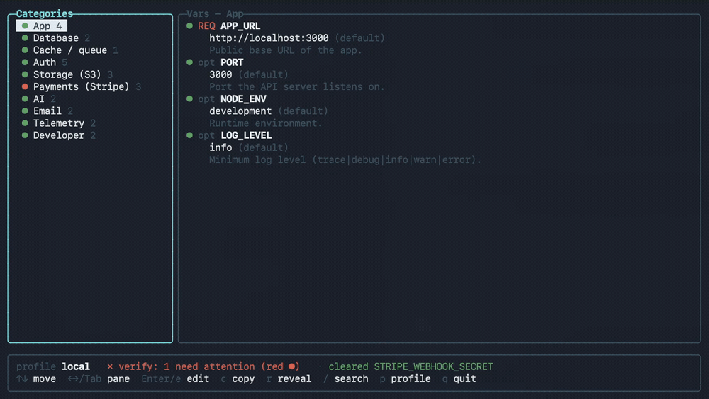

# vault

[](https://github.com/brettabalmer/vault/releases)
[](https://www.npmjs.com/package/@brettbalmer/vault-reader)
[](https://www.nuget.org/packages/Brettabalmer.Vault.Reader)
[](LICENSE)

<p align="center">
  
</p>

A tiny, encrypted, **git-committable** secrets store for local development. One manifest documents every
variable (category, description, whether it's required, which platforms need it); one text vault file holds the
values — non-secrets in plaintext, secrets as per-value AES-256-GCM tokens. Native readers seed the values into
each platform's process environment at boot, so **you never hand-edit a `.env` or `local.settings.json` again**.

Built because real projects scatter secrets across `.env`, `.env.local`, several `local.settings.json`, and
deploy files, with no record of what's required or what a new developer must set.

> **Packages** —  npm [`@brettbalmer/vault-reader`](https://www.npmjs.com/package/@brettbalmer/vault-reader),
> NuGet [`Brettabalmer.Vault.Reader`](https://www.nuget.org/packages/Brettabalmer.Vault.Reader). The CLI ships
> as a binary via [Releases](https://github.com/brettabalmer/vault/releases) + a Homebrew tap.


---

## Install

```bash
# CLI (macOS / Linux)
brew install brettabalmer/tap/vault

# C# reader
dotnet add package Brettabalmer.Vault.Reader

# Node reader
npm install @brettbalmer/vault-reader
```

## How it works

Three pieces, two of them committed and edited **only through the tool**:

- **`vault/manifest.json`** (committed, plaintext) — the schema: every var's `category`, `description`,
  `required` (`yes` \| `devOnly` \| `no` — `devOnly` = needed for local dev but not the deployed cloud apps),
  `secret`, `personal`, `platforms`, `default`, optional `validate` regex, and an agent `source`
  hint (`emulator` \| `derived` \| `az` \| `user` \| `external`). The single source of truth for "what does a
  new dev need".
- **`vault/local.enc`** (committed, encrypted) — the values, as a **text file** (see [`FORMAT.md`](FORMAT.md)):
  a `#vault:2` header carrying the vault's **identity**, then `KEY=VALUE` lines — non-secret values in
  plaintext, secrets as `enc:<base64>` per-value AES-256-GCM tokens (deterministic, so unchanged secrets don't
  churn and git can line-merge across branches/worktrees). A gitignored **`personal.enc`** layers per-developer
  overrides on top.
- **`~/.config/vault/key`** (never committed) — a **keyring** of `<id> :: <base64 key>` pairings, one per
  vault. Each vault's `local.enc` header names its identity; the reader picks the matching key. Onboarding a new
  machine = get the pairing out-of-band (`vault share-key` → `vault add-key`).

Readers seed values into the environment **only for keys not already set** (so per-worktree overrides and real
cloud settings win), and are **dev-only** — they no-op in Azure (`WEBSITE_INSTANCE_ID` present), where deployed
apps read their own App Service settings.

## Quick start (new project)

```bash
vault init                                   # create vault/manifest.json + a vault identity + key
vault manifest add COSMOS_ENDPOINT --no-secret --default https://localhost:8081 --platforms worker
vault manifest add COSMOS_KEY --required --platforms worker
vault set COSMOS_KEY --stdin                 # paste the value; stays out of shell history
vault check                                  # nonzero exit if anything required is unset
```

Onboarding a teammate onto an existing vault:

```bash
# on your machine
vault share-key                              # copies "<id> :: <key>" to your clipboard — send it out-of-band
# on theirs
vault add-key "<id> :: <key>"                # then `vault check` works
```

## For agents / automation

The whole surface is scriptable and non-interactive:

- **Never hand-edit** `.env` / `local.settings.json` for a secret — go through `vault`.
- `vault missing --json` — required-but-unset vars, each with a `source` hint. Auto-fill `emulator`/`derived`
  values and pull `az` ones via the Azure CLI; ask the human only for `user`/`external` (API keys, etc.).
- `vault set KEY --stdin` — set one value without leaking it into argv or shell history; touches only that key.
- `vault check` — gate: nonzero exit, naming the missing/invalid var. `vault list --json` for full status.
- `vault export --platform <p> --format json` — a machine-readable slice for a given platform.

## Commands

```
vault                       full-screen TUI (Spectre.Console)
vault init [--force]        give this vault an identity (+ manifest if missing); --force resets id + key
vault rekey                 rotate to a new id + key, preserving values (needs the current key)
vault share-key [--stdout]  copy this vault's "<id> :: <key>" pairing to the clipboard
vault add-key "<id>::<key>" add a teammate's pairing to your keyring (--stdin | --clipboard)
vault keygen                write a legacy bare key (prefer `vault init`)

vault check | verify        validate required vars present + values match their format; nonzero exit on failure
vault list                  status table (--category --platform --missing --json)
vault missing --json        required-but-unset vars, machine-readable
vault get KEY [--reveal]    one value, masked by default
vault set KEY VALUE         set one value (or KEY --stdin); --personal → gitignored per-dev personal.enc
vault unset KEY             remove a value
vault describe KEY          a var's metadata
vault export --platform P   materialize a slice (--format dotenv|json|shell) (--no-defaults)
vault run -- CMD            run CMD with the vault injected into its env

vault manifest add KEY      define a var (--category --description --platforms a,b --default
                              --required yes|devOnly|no --secret --personal … and their --no- forms);
                              creates the manifest if absent
vault manifest set KEY      edit an existing var's fields
vault manifest rm KEY       remove a var definition
vault import --from DIR     one-time migration from scattered env files
```

Global flag: `--profile <name>` (default `local`; the tool supports multiple profiles per vault).

Key resolution order for a vault of identity `id`: `$VAULT_KEY` → `$VAULT_KEY_FILE`/keyring `[id]` → legacy bare
key. See [`FORMAT.md`](FORMAT.md) for the full contract.

## Consuming it as a library

**C#** (`Brettabalmer.Vault.Reader`; namespace `Vault.Core`) — first line of `Program.cs`:

```csharp
using Vault.Core;

EnvSeeder.SeedEnvironment("worker");   // seeds env for the "worker" platform; silent, dev-only, only-fills-unset
```

**Node** (`@brettbalmer/vault-reader`) — before anything reads `process.env`:

```js
import { seedEnvironment } from "@brettbalmer/vault-reader";

seedEnvironment({ platform: "sveltekit", enabled: isDev });
```

Both are silent (never throw, never write to stdout — safe in isolated workers), keyring/identity-aware, and
no-op in Azure. Every reader agrees on [`FORMAT.md`](FORMAT.md), enforced by the shared fixtures in
[`testvectors/`](testvectors/) (decrypted identically by the C# and JS suites in CI).

## Layout

```
FORMAT.md            the contract: keyring, vault file (v2), manifest schema, identity — all readers obey it
testvectors/         cross-language conformance fixtures (C# + JS decrypt them identically)
src/Vault.Core/      reference impl + reader: crypto, keyring, vault file, manifest, resolve, EnvSeeder
src/Vault.Cli/       the `vault` binary (Spectre.Console)
src/Vault.Tests/     unit + conformance tests
packages/js/         the @brettbalmer/vault-reader npm reader (+ conformance test)
.github/workflows/   ci (test C#/JS vs testvectors) + release (binaries, npm, NuGet)
```

## Develop

```bash
dotnet test src/Vault.Tests/Vault.Tests.csproj          # unit + conformance
( cd packages/js && node --test )                        # JS conformance
dotnet publish src/Vault.Cli -r osx-arm64 -c Release      # standalone binary → bin/.../publish
```

## Releasing

Tag `vX.Y.Z` (`git tag v0.3.3 && git push origin v0.3.3`). CI builds the CLI binaries, attaches them to a
GitHub Release, and publishes both reader packages — **npm and NuGet both via OIDC Trusted Publishing, no
long-lived tokens** (gated on the `PUBLISH_NPM` / `PUBLISH_NUGET` repo variables; NuGet also uses `NUGET_USER`).
Package versions come from `packages/js/package.json` and `src/Vault.Core/Vault.Core.csproj` — keep them in step
with the tag.

## License

MIT.
